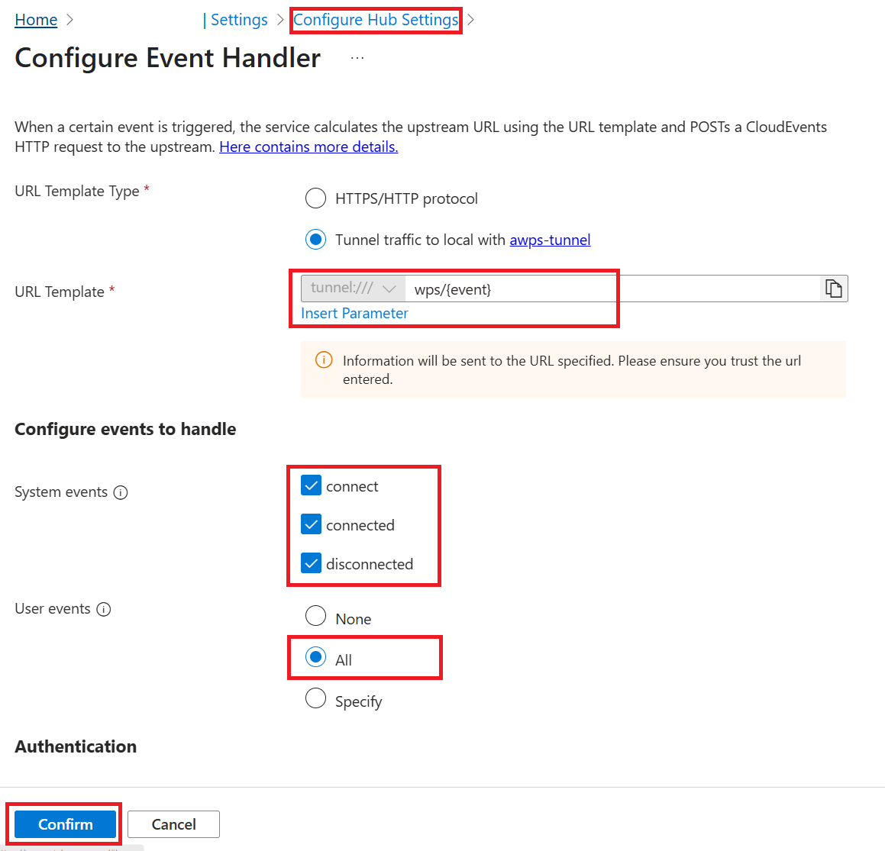
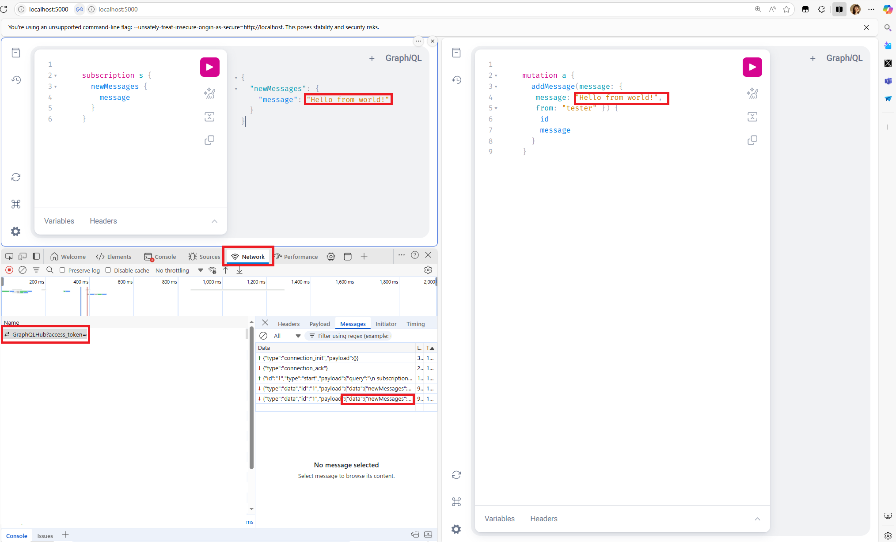

# WebPubSub Integration in Samples.Basic

## What Has Changed

- **WebPubSub Support Added:**  
  The sample project now supports real-time GraphQL subscriptions using Azure Web PubSub (AWPS) as a transport layer.
- **Event Handler Configuration:**  
  The project is configured to handle events from the `graphqlhub` hub via the AWPS event handler endpoint.
- **Transport Extension:**  
  A new transport extension (`WebPubSubTransportExtension.cs`) is included to bridge GraphQL subscriptions with AWPS.
- **GraphQL Subscription Over WebSockets:**  
  The server now listens for subscription events from AWPS, enabling real-time updates to clients connected through the Web PubSub service.

## Why It Works

Azure Web PubSub acts as a real-time messaging broker between clients and the backend GraphQL server. When a client subscribes to a GraphQL subscription, AWPS forwards the subscription request to the backend using the configured **Event Handler**. When a mutation triggers a new message, the backend notifies AWPS, which then pushes the update to all subscribed clients. The custom transport extension ensures that GraphQL subscription events are correctly mapped to AWPS events and vice versa.

## Limitations and Considerations

- **Sticky Sessions Required:**  
  Requests from a single `connectionId` (i.e., a single WebSocket client) must always be routed to the same upstream server instance. This is necessary because GraphQL subscriptions maintain state per connection, and routing requests to different servers can break the subscription flow.
- **Scaling:**  
  When scaling out the backend, ensure that your load balancer or AWPS configuration supports sticky sessions (session affinity) based on `connectionId`.
- **AWPS Tunnel (Optional):**  
  The AWPS tunnel is only needed if you are developing your GraphQL server locally, and need to tunnel traffic to your local server.
- **Limited to GraphQL Subscriptions:**  
  Only GraphQL subscriptions are routed through AWPS. Queries and mutations are handled as usual via HTTP.

## How to Test WebPubSub Integration
0. Create a Azure Web PubSub Service and in **Keys** tab find the connection string of this service. Set the connection string as Environment Variable `WebPubSubConnectionString`.


1. **Configure Event Handler for Hub `graphqlhub`:**

   In your Azure Web PubSub portal, set the event handler to:
   ```
   tunnel:///wps/{event}
   ```
   Or, if not using a tunnel, set it to your server's public endpoint:
   ```
   https://<your-server-endpoint>/wps/{event}
   ```
    
    

2. **(Optional) Start AWPS Tunnel:**

   Set WebPubSubConnectionString 
   If you need to tunnel traffic to local and view vivid network traffic, run below command and visit http://localhost:8888:

   ```
   awps-tunnel run --hub graphqlhub --upstream http://localhost:5000 --webviewPort 8888
   ```

   Alternatively, you could directly expose your local server endpoint to public.

3. **Start the Sample Project:**

   Launch the `Samples.Basic` project (e.g., `dotnet run` or via your IDE).

4. **Test with GraphQL Playground:**

   - Open [http://localhost:5000](http://localhost:5000) in two browser tabs.

   - In the first tab, run the following subscription:
     ```graphql
     subscription s {
       newMessages {
         message
       }
     }
     ```

   - In the second tab, run the following mutation:
     ```graphql
     mutation a {
       addMessage(message: { message: "Hello from world!", from: "tester" }) {
         id
         message
       }
     }
     ```

   - You should see the new message appear in real-time in the subscription tab, confirming that WebPubSub is working.

   - You could start a new tab with Network Developer Tool opened, and you could see a WebSocket connection established with your Web PubSub resource, and Messages going through the WebSocket connection.
   - 
   